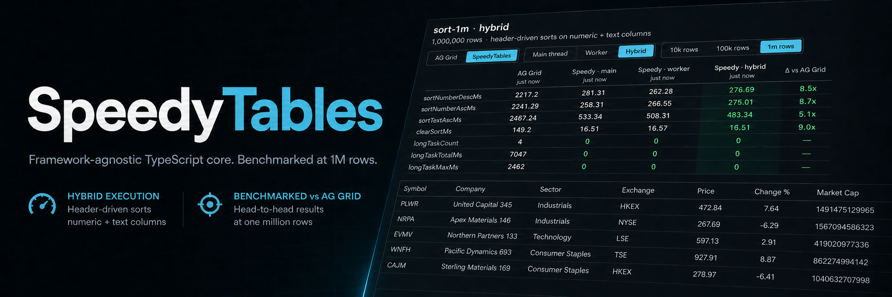

<p align="center">
  
</p>

# SpeedyTables

A personal exploration project: how fast can a data grid get when performance is the first constraint, measured honestly at every step?

The core (`@speedytables/core`) is headless, plain TypeScript with zero framework dependencies. It handles the row pipeline (filter, sort, windowing), delta updates, and worker execution, and exposes per-slice subscriptions that any UI layer can bind to. The first UI package is for Svelte 5 (`@speedytables/svelte`), with a React adapter planned. If you want to bring your own rendering, the core is usable on its own today.

To be clear about scope: this does not come close to AG Grid's feature surface, and it is not trying to. AG Grid has hundreds of features built over a decade. This project has a handful, chosen because each one exercises a different performance bottleneck at a million rows. What it does have is receipts: every feature ships with recorded head-to-head numbers against AG Grid Community on identical seeded data, captured by an automated harness.

## Status

Pre-alpha. The benchmark infrastructure landed first, so every feature that followed has honest before and after numbers.

## Features

Numbers are medians at 1,000,000 rows vs AG Grid Community on identical data ([full report](tools/bench/results/REPORT.md)).

- **Virtualized rendering** (v0.1.0): a million rows mount in about 40ms (AG Grid: about 685ms) using half the memory and a quarter of the CPU. Works in any browser regardless of scroll-height limits.
- **Smooth scrolling at 1M rows** (v0.2.1): a sustained full-height scroll sweep holds 60fps with zero main-thread stalls and a worst frame of 18.8ms, on 3.1x less CPU than AG Grid (whose worst frame is 41.2ms at the same frame rate).
- **Sorting** (v0.2.0): sorting a million rows takes about 250ms on numbers and 450ms on text, 6 to 9x faster than AG Grid (2.2 to 2.6s), and the UI never freezes. Work runs in small time slices, so the grid stays scrollable mid-sort. AG Grid blocks the page for up to 2.6s per sort.
- **Filtering** (v0.3.0): typing into a text filter over a million rows, the first keystroke scans everything in about 114ms and every following keystroke refines only the previous matches, landing under two frames (about 33ms) vs 232 to 376ms per keystroke for AG Grid. Enum and set filters apply in 30 to 66ms vs 259 to 667ms. None of it freezes the page (AG Grid blocks up to 656ms per filter).
- **Live updates** (v0.4.0): streaming 1,000 row updates per second into a million sorted and filtered rows, the grid holds 60fps and applies 99.8% of ticks on time with zero main-thread stalls. AG Grid under the same load renders about 3 frames per second (worst stall: 4.2s) and falls behind on a third of the updates. Updates go through an explicit `applyDelta` API keyed by row id, coalesced per frame.
- **Worker execution** (v0.5.1): heavy compute can run on a web worker. Sorting a million rows drops main-thread work from about 1.3s of slices to about 0.3s with identical results and equal or better wall time. Three modes ship, all benchmarked: main-thread, full worker, and hybrid (filters stay on the main thread where their data lives, sorts go to the worker). Hybrid is the default.
- **Column controls and wide grids** (v0.6.0): drag to resize, drag headers to reorder, hide and show columns from a per-column menu. Columns are virtualized like rows: a 150-column grid renders only the 13 or so in view, holds 60fps on a full-width sweep, and sorts in 33ms vs AG Grid's 49ms.
- **Themes** (v0.7.1): five shipped token themes (import a CSS file, set `data-speedy-theme`) over a documented token contract, plus a Tailwind part-class preset that composes with your own Tailwind config. Fully headless remains the base layer. Browse them side by side at `/themes` in the demo. The themed grid keeps every prior number.
- **Theme editor** (v0.8.0): build a theme in the browser at `/themes/editor` in the demo. Pick a base theme, edit any token with OKLCH sliders or plain text over a live grid, undo and redo, save named themes locally, share a link, and export the finished CSS or JSON ready to drop into your app. The theme you pick in the gallery or editor follows you onto every scenario page. No numbers to record here: it is tooling over the same themed grid measured above, and benchmark runs pin their theme explicitly.

Comparisons use a deliberately minimal, production-configured AG Grid (see [fairness notes](docs/benchmarking.md)).

## Benchmarks

Scenario pages live in the demo app and run against both grids. Latest results: [`tools/bench/results/REPORT.md`](tools/bench/results/REPORT.md); raw history in the same directory, metric definitions in [`docs/benchmarking.md`](docs/benchmarking.md).

```sh
pnpm install
pnpm bench          # all scenarios
pnpm bench sort-1m  # one scenario
```
