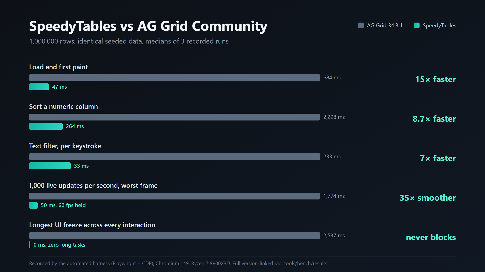
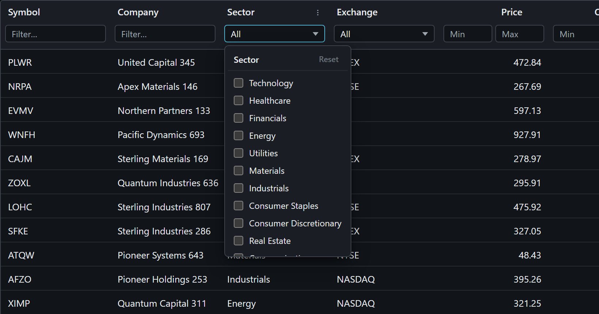
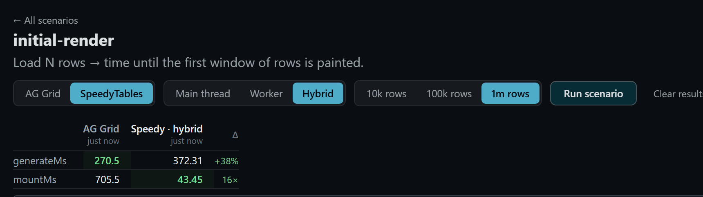
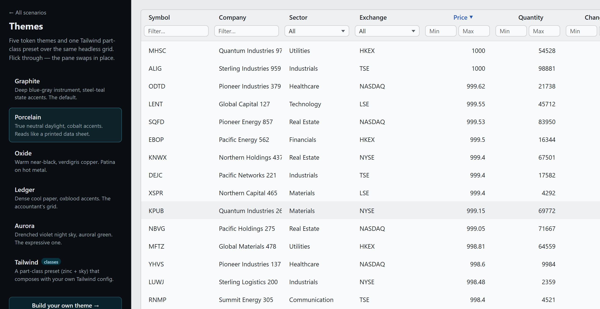
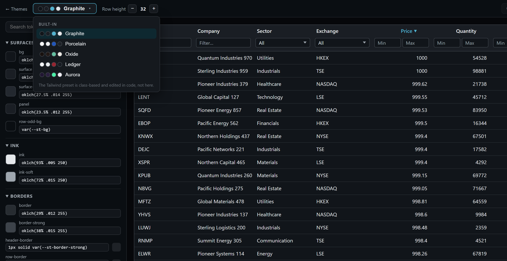

# A tour of SpeedyTables

This is the read-this-first document. Every section names a piece of the codebase, says what it does and why it exists in a few sentences, and links to the real code. The collapsible blocks hold the deeper reasoning, so you can skim the whole project in a few minutes and only expand what you care about. Line-numbered links point at the defining line as of v0.8.0; if the code moves later, search for the symbol name in the text.

  

Every number above is a recorded median from the automated harness, not a claim. The full version-linked log lives in [`tools/bench/results`](../tools/bench/results/REPORT.md).

## The map

| Where | What it is |
| --- | --- |
| [`packages/core`](../packages/core/src) | The engine. Headless, plain TypeScript, zero dependencies, about 1,500 lines. |
| [`packages/svelte`](../packages/svelte/src) | The Svelte 5 adapter: reactive bindings, `Table.*` components, themes. About 700 lines. |
| [`apps/demo`](../apps/demo/src) | The demo app. Every page is simultaneously a working example and a benchmark scenario. |
| [`tools/bench`](../tools/bench/src) | The Playwright + CDP harness that produced every number in this repo. |
| [`docs/adr`](adr) | Five short decision records. When you wonder "why is it built this way", the answer is usually here. |
| [`CONTEXT.md`](../CONTEXT.md) | The project glossary. Every term used below (stage, slice, delta, token, part) is defined there. |

## The core engine (`@speedytables/core`)

### The row pipeline

**[`pipeline.ts`](../packages/core/src/pipeline.ts)** (about 320 lines, all of it one class: [`RowPipeline`](../packages/core/src/pipeline.ts#L14)). All data flows through one fixed sequence: source rows, then filter, then sort, then window. Each stage is memoized and only reruns when something it depends on actually changed, so typing a character in a filter never re-sorts, and scrolling never re-filters.

<b>Why a fixed staged pipeline instead of a plugin graph</b>

Extensibility usually means a generic transform graph, and generic graphs make every operation pay for flexibility nobody asked for. Here a "feature" (sorting, filtering) is an implementation of one named stage. An absent feature costs literally nothing: an empty sort or filter model short-circuits its stage. The fixed order also makes invalidation trivial: a change dirties one stage, and everything after it reruns at most once per frame. Decision record: [ADR-0001](adr/0001-staged-row-pipeline.md).

One honesty note: the ADR's original "wired at grid construction" phrasing describes an API that was never built. The stages are hard imports, chiefly because worker rebuilds are declarative and a consumer-supplied stage function cannot cross the thread boundary. The [ADR-0001 amendment](adr/0001-staged-row-pipeline.md#amendment-2026-07-13-v080-the-construction-time-wiring-was-never-built) records the drift and the reasoning.

One consequence worth knowing: text filters refine. Typing "app" then "appl" only re-scans the rows that already matched "app", which is why keystrokes after the first land in about 33ms at a million rows instead of re-scanning everything.

### Sorting that never freezes the page

**[`sort.ts`](../packages/core/src/sort.ts)** (84 lines, one entry point: [`sortIndexJob`](../packages/core/src/sort.ts#L22)). A stable chunked merge sort written as a generator: it sorts 16k-row runs, then merges them, yielding control between chunks. The UI thread breathes the whole time, which is why a million-row sort shows zero long tasks while AG Grid blocks the page for up to 2.5 seconds.

<b>Why a generator, and what the numbers say</b>

Writing the sort as a generator separates the algorithm from the scheduling. The same code runs time-sliced on the main thread (12ms slices via `scheduler.yield`) or straight through on a worker, because the executor decides when to pump it. Sorting a million numbers lands in about 264ms wall time either way; the difference is where the CPU burn happens (see the executor section). Re-sorting mid-sort aborts the old job cleanly. Sort keys come from columnar projections ([`buildProjection`](../packages/core/src/projection.ts#L13)): per-column typed arrays extracted once, so the hot loops never touch row objects.

### Filtering

**[`filter.ts`](../packages/core/src/filter.ts)** (46 lines, the smallest interesting file in the repo). Filters are declarative specs (contains, in-set, range), which keeps them serializable, so they can cross to a worker, and comparable, so the pipeline can detect a narrowing and refine instead of re-scanning. The scan itself is [`filterIndicesJob`](../packages/core/src/filter.ts#L10); the narrowing test that unlocks refinement is one small function, [`narrows`](../packages/core/src/filter.ts#L29).

### The executor seam: main thread, worker, or both

**[`executor.ts`](../packages/core/src/executor.ts)**, **[`worker-bridge.ts`](../packages/core/src/worker-bridge.ts)**, **[`pipeline.worker.ts`](../packages/core/src/pipeline.worker.ts)**. The pipeline is thread-agnostic; an injected executor decides where work runs. Work units are generator [`Job`s](../packages/core/src/executor.ts#L8); the [`Executor`](../packages/core/src/executor.ts#L10) interface has a [`MainThreadExecutor`](../packages/core/src/executor.ts#L25) that pumps jobs in 12ms slices, and the worker path goes through [`WorkerBridge`](../packages/core/src/worker-bridge.ts#L20). Three modes ship, all benchmarked: main-thread (time-sliced), worker, and hybrid. Hybrid is the default because it measured best: filters stay on the main thread where their data lives, sorts go to the worker.

<b>Why hybrid won, with the recorded evidence</b>

Generators cannot cross threads, so the worker protocol works at the operation level: the main thread sends a declarative rebuild message, the worker keeps a versioned mirror of the columnar projections, and results come back as zero-copy `Uint32Array` transfers.

The measured trade at a million rows: moving sorts to the worker cuts main-thread CPU from about 1,325ms to about 302ms with equal or better wall time. But moving *filters* to the worker means shipping every text column across, which costs a one-time ~0.2s handoff and about 99MB of worker heap. Hybrid keeps filters main-side (0.33MB worker heap, identical keystroke latency) and still gets the worker sort win. That is the whole argument, and it is recorded in [`tools/bench/results`](../tools/bench/results/REPORT.md) with worker heap measured over CDP. Decision record: [ADR-0002](adr/0002-thread-agnostic-pipeline-injected-executor.md).

### A million rows in one scrollbar

**[`viewport.ts`](../packages/core/src/viewport.ts)** (62 lines, essentially two functions: [`computeWindow`](../packages/core/src/viewport.ts#L32) and [`virtualHeight`](../packages/core/src/viewport.ts#L28)). The window math: which rows are in view, where they sit. The virtual canvas is capped at 8 million pixels with proportional scroll mapping, because real browsers clamp element heights (Chromium at about 33.5M px, Firefox at about 17.9M px) and they clamp *silently*: rows past the cap just become unreachable. **[`hviewport.ts`](../packages/core/src/hviewport.ts)** ([`computeHWindow`](../packages/core/src/hviewport.ts#L16)) does the same for columns with variable widths, which is how a 150-column grid renders only the 13 or so actually visible.

### Live updates

**[`grid.ts`](../packages/core/src/grid.ts)**, the [`applyDelta`](../packages/core/src/grid.ts#L241) path. Row mutations go through one explicit API, keyed by a required row id: `applyDelta({ insert, update, remove })`. Deltas arriving within one frame coalesce into a single incremental patch of the existing filtered and sorted output, instead of a pipeline rerun.

<b>Why an explicit delta API, and the honest complexity note</b>

Diffing consumer arrays to discover what changed is the expensive, guess-prone alternative; requiring the caller to say what changed makes the fast path possible. The patch updates projections in place, works out which rows enter or leave the filter, and does one merge pass per output array per frame, O(output + k log k) for k changed rows. That is a recorded deviation from the O(k log N) aspiration (documented in [ADR-0004](adr/0004-delta-mutation-api-with-required-row-id.md)); it is what lets the grid apply 4,991 of 5,000 ticks at 60fps while AG Grid applies 3,380 with a 1.8 second worst frame. Inserts and removes fall back to a full rebuild.

### The orchestrator

**[`grid.ts`](../packages/core/src/grid.ts)** (about 500 lines, the largest file in the core). The class is [`Grid`](../packages/core/src/grid.ts#L29); consumers enter through [`createGrid`](../packages/core/src/grid.ts#L505) with a [`GridConfig`](../packages/core/src/types.ts#L31). It owns column state (order, widths, visibility), runs the pipeline through the executor, and exposes everything as independently subscribable *slices* (window, sort model, filter model, columns, scroll position). Notifications are per-slice and payloads are window-sized, never dataset-sized, which is the contract that keeps any UI framework cheap to bind. Decision record: [ADR-0003](adr/0003-agnostic-core-package-with-slice-subscriptions.md).

## The Svelte package (`@speedytables/svelte`)

### The adapter

**[`view.svelte.ts`](../packages/svelte/src/view.svelte.ts)** (136 lines, one class: [`GridView`](../packages/svelte/src/view.svelte.ts#L18)). Maps each core slice onto a `$state.raw` rune. That is the entire framework integration; there is no grid logic in it, by rule. A React adapter would be a sibling file of similar size.

### The components

**[`components/`](../packages/svelte/src/components)**: `Table.Root / Header / Viewport / Row / Cell` plus [`FilterControl`](../packages/svelte/src/components/FilterControl.svelte) (text, range, and enum filters built into the header) and [`ColumnMenu`](../packages/svelte/src/components/ColumnMenu.svelte). Thin and unstyled by default; every element is addressable as a named *part* (the [`Part`](../packages/svelte/src/parts.ts#L7) union, 22 of them) via a `data-speedy-*` attribute and a [`PartClasses`](../packages/svelte/src/parts.ts#L33) map.

<b>Two UI details that took real debugging</b>

Dropdown panels use the native Popover API: they render in the browser's top layer, so no overflow or stacking context inside the grid can ever clip them, and light-dismiss plus Escape come free. Two hard-won details are baked in. First, positioning: a popover's `toggle` event fires a task *after* the first paint, so panels hide themselves at `beforetoggle` and reveal only once anchored, otherwise every open flashes one centered frame. Second, geometry: width-carrying elements set `box-sizing: border-box` inline, because a content-box padding mismatch once shifted every column after the first by 20px. The [smoke suite](../tools/bench/src/smoke.ts) now checks header and cell alignment on every run.

### Theming

**[`themes/`](../packages/svelte/src/themes)**. Two mechanisms over one structural stylesheet ([`base.css`](../packages/svelte/src/themes/base.css)): token themes (import a CSS file, set `data-speedy-theme="graphite"`) and part-class presets ([`tailwindTheme`](../packages/svelte/src/themes/tailwind.ts#L15) composes with your own Tailwind config). The token contract is a documented manifest, [`TOKENS`](../packages/svelte/src/themes/tokens.ts#L17), which is also what powers the theme editor. Decision record: [ADR-0005](adr/0005-two-mechanism-styling-api.md).

<b>Why two mechanisms, and what theming costs</b>

Tokens cover the common case (colors, spacing, radii, motion) with zero per-node weight: one attribute on an ancestor. Part classes exist for teams whose design system lives in utility classes and for structural changes tokens cannot express. The escalation path is documented: token override, then attribute CSS, then part classes, then snippet overrides, then the headless core. The cost was measured, not assumed: the Tailwind preset holds the same 60fps with zero long tasks and about 34% more scroll CPU from utility-class weight, recorded in the report.

## The demo app is the benchmark suite

### Scenario pages

**[`apps/demo/src/lib/scenarios`](../apps/demo/src/lib/scenarios/index.ts)** defines seven scenarios (initial-render, sort-1m, filter-1m, enum-filter, scroll-storm, live-updates, wide-grid), each targeting a different bottleneck. Each is a [`Scenario`](../apps/demo/src/lib/scenarios/types.ts#L11), collected into the [`scenarios` catalog](../apps/demo/src/lib/scenarios/index.ts#L181). **[`routes/scenarios/[name]`](../apps/demo/src/routes/scenarios/%5Bname%5D/+page.svelte)** renders them with grid, compute, and size toggles, and exposes a `window.__scenario` handle ([registered here](../apps/demo/src/routes/scenarios/%5Bname%5D/+page.svelte#L150)) that the harness drives. Results persist per variant in a comparison table with color-coded winners and a delta column.

### One driver interface, two grids

**[`lib/drivers`](../apps/demo/src/lib/drivers/types.ts)**. Scenarios never talk to a grid directly; they call a [`GridDriver`](../apps/demo/src/lib/drivers/types.ts#L22) (mount, sortBy, filterContains, filterIn, applyUpdates, scroll handles). [`agGridDriver`](../apps/demo/src/lib/drivers/aggrid.ts#L44) and [`speedyDriver`](../apps/demo/src/lib/drivers/speedy.ts#L10) implement it identically, which is what makes the comparison apples to apples: same seeded data, same row heights, same operations, timed the same way. The data itself is deterministic: [`generateTrades`](../apps/demo/src/lib/dataset.ts#L57), [`generateWide`](../apps/demo/src/lib/dataset.ts#L84), and the [`generateTicks`](../apps/demo/src/lib/dataset.ts#L99) update stream all draw from a fixed-seed [`mulberry32`](../apps/demo/src/lib/dataset.ts#L47) PRNG, so every run and both grids see identical rows. The AG Grid setup is deliberately minimal and production-configured; the fairness reasoning is in [`docs/benchmarking.md`](benchmarking.md).

### The theme gallery and editor

**[`routes/themes`](../apps/demo/src/routes/themes)**. The gallery shows all six shipped themes over the same live grid; picking one carries onto every scenario page (bench runs pin their theme explicitly, so recorded numbers are unaffected).

The editor at `/themes/editor` is a token-native theme builder: pick a base, edit any token with OKLCH sliders over the live grid, undo and redo, save locally, share via URL, export CSS or JSON. Base values come from a computed-style probe ([`probeTheme`](../apps/demo/src/lib/editor/probe.ts#L13)), so the editor never duplicates the theme CSS it edits.

## The harness that produced the numbers

**[`tools/bench/src/run.ts`](../tools/bench/src/run.ts)**. Playwright drives each scenario page in Chromium against a production preview build, three runs per scenario, reporting medians. In-page performance marks measure operation latency; a `PerformanceObserver` counts long tasks (the "does the UI freeze" metric); CDP supplies process CPU and heap, including worker heap read from outside the worker (dedicated workers expose no memory API of their own). **[`report.ts`](../tools/bench/src/report.ts)** regenerates [`REPORT.md`](../tools/bench/results/REPORT.md) (newest run per scenario, grid, and variant) and [`HISTORY.md`](../tools/bench/results/HISTORY.md) (the chronological log, every result linked to package versions and commits). **[`smoke.ts`](../tools/bench/src/smoke.ts)** runs eleven structural checks (alignment, popovers, filter-to-zero recovery) as the fast regression gate.

<b>The measurement caveats, honestly</b>

Latency measurement uses a double-requestAnimationFrame fence, which has a floor of about 33ms (two vsync frames): anything faster reads as "at most two frames", identically for both grids. The live-updates `ticksApplied` metric counts ticks the grid acknowledged, not ticks visually painted, so it favors neither side but is not proof of paint. Scroll benches must run against the preview build, never the dev server. All of this and more is written down in [`docs/benchmarking.md`](benchmarking.md), because a benchmark you cannot audit is marketing.

## Where the decisions live

| Record | The decision in one line |
| --- | --- |
| [ADR-0001](adr/0001-staged-row-pipeline.md) | A fixed staged pipeline; features are stage implementations, not plugins. |
| [ADR-0002](adr/0002-thread-agnostic-pipeline-injected-executor.md) | The pipeline is thread-agnostic; an injected executor picks main thread, worker, or hybrid. |
| [ADR-0003](adr/0003-agnostic-core-package-with-slice-subscriptions.md) | A framework-free core with per-slice, window-sized subscriptions; adapters hold no grid logic. |
| [ADR-0004](adr/0004-delta-mutation-api-with-required-row-id.md) | Mutations are explicit deltas keyed by a required row id, coalesced per frame. |
| [ADR-0005](adr/0005-two-mechanism-styling-api.md) | Two styling mechanisms (tokens and part classes) over one documented contract. |

If a term in this tour was unfamiliar, [`CONTEXT.md`](../CONTEXT.md) defines the project's vocabulary in one page.
